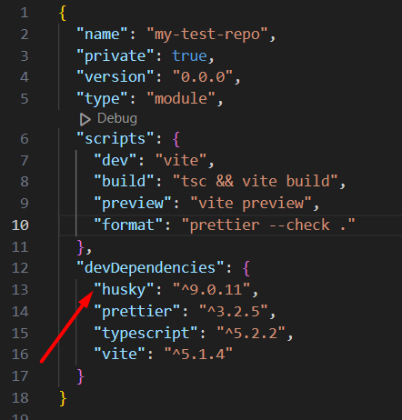
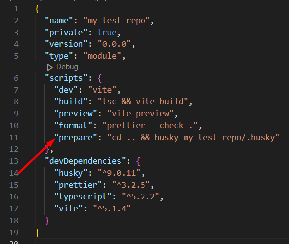
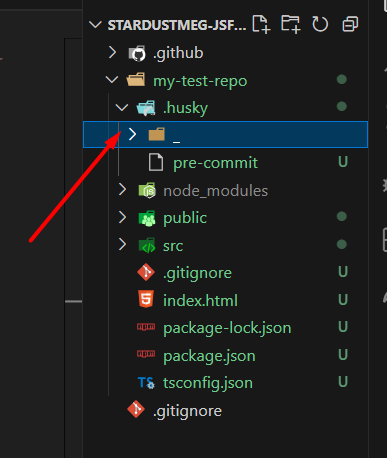
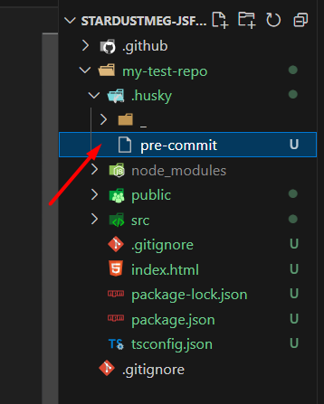
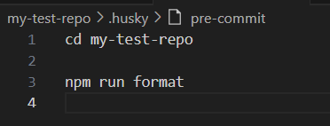
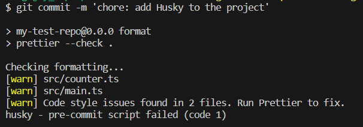
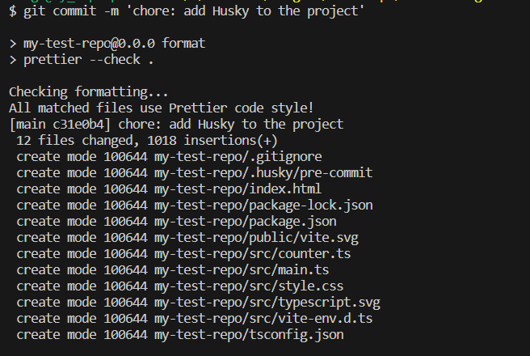

<h1 style="text-align: center; color: ">How to... Husky</h1>

<p align="center">
  
</p>

#### This is pretty much the most basic guide to taming these mischivous Husky, but hopefully it'll give you a general overview on how you can use them. Believe me, they can brighten your day and do so much more! Husky is awesome! And together with other tools can take care of a good bulk of routine for you.

_You can always find out more in their [official documentation](https://typicode.github.io/husky/)._

Not to delay any further let's look at how to start using them in our school's repository.

### ✨ Step 1:

First of all, you'll have to initiate your project to have a perfect home for your Husky.
You can also think about some friends for them and install Prettier or ESLint beforehand for them to have someone to play with.

I'm also doing my example in a school's repo branch. I have already initiated a TS Vite project and installed Prettier.

To get started you'll have to open your project's folder and run the following command in your terminal:

```js
npm i -D husky
```

Notice that it needs to be installed as a devDependency (check out your `package.json` to make sure it's installed properly).



Congrats! You're on the way to get your own Husky!

### ✨ Step 2:

The next step is a bit tricky since we're working with a school's repository and have separate folders for various projects (you can find some information about that in the [official documentation](https://typicode.github.io/husky/how-to.html#project-not-in-git-root-directory) or just keep reading this 😉)

run

```js
npx husky init
```

in your terminal. You'll see new `.husky` folder appear in your project's directory and a script file where your Husky will live.


You're getting closer!

### ✨ Step 3:

Go to your `package.json` file and replace the created `"prepare": "husky"` script with the following (don't forget to replace my `my-test-repo` folder name with your actual project's folder name):

```json
"prepare": "cd .. && husky my-test-repo/.husky"
```



You're one step closer to your prize!

### ✨ Step 4:

Now is the time to run some console commands again! Just run this one:

```js
npm run prepare
```
Notice that a `_` folder appeared. This one actually shouldn't interest you at all (seriously, no trespassing, don't even touch it 😁).



### ✨ Step 5:

You'll create files for your hooks in `.husky` and since we already have a `pre-commit` here let's work with that.



We're actually getting to the most interesting part! You need to decide what you want your Husky to do for you! Let's say that mine is going to check file formatting for me using Prettier and not let me commit anything unless I fix it.

That's exactly what I tell it to do:

```json
cd my-test-repo
npm run format
```

An important thing to notice it that with my first line I tell my Husky not to wander around and to go straight to my project's folder (❗remember to replace it with your actual folder's name).



### ✨ Step 6:

Finally, the time has come to check that everything works as expected! Run a command to stage your changes:

```js
git add .
```

### ✨ Step 7:

That's pretty exciting, isn't it? Can you feel your heart pounding? Great! Now run a command to add a commit:

```js
git commit -m 'chore: add Husky to the project'
```



Perfect! Everything failed and it didn't let us commit the changes as expected! It's time to fix it.

### ✨ Step 8:

I've fixed formatting in the mentioned files and run the command once again to check that everything is ok:

```js
git commit -m 'chore: add Husky to the project'
```



🌟 Success! The changes are commited!

Congrats on getting your first Husky! Hopefully you'll want to get more of them!

<h2 style="text-align: center; color: ">🍀 Good luck and remember you're awesome 🍀</h2>

<p align="center">
  
</p>